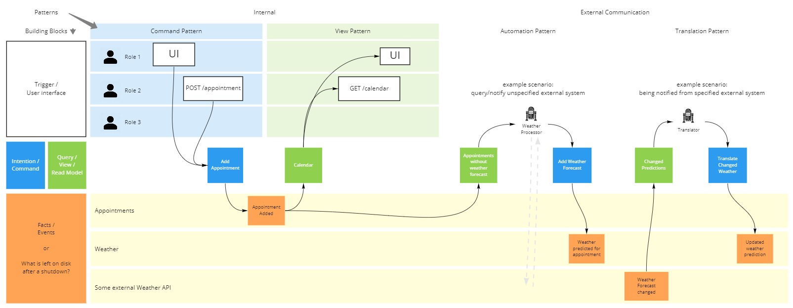
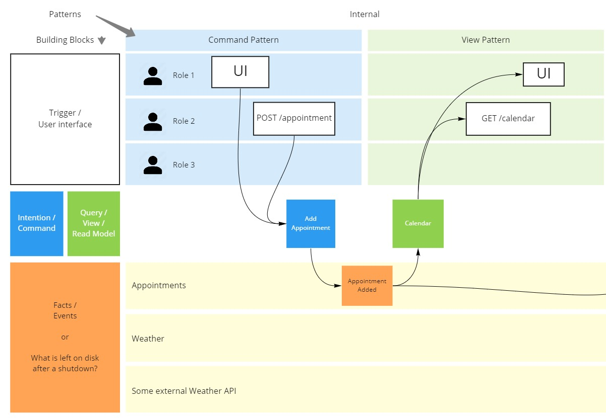
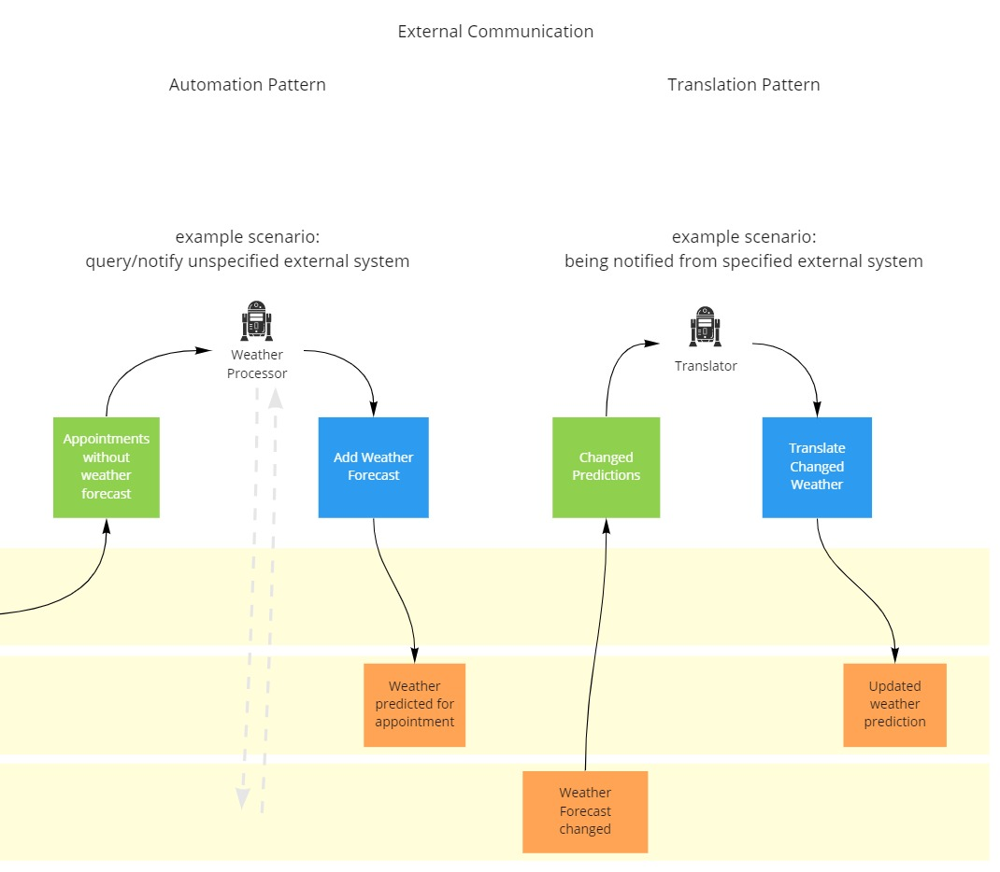

# Шпаргалка по событийному моделированию

[Download as PDF](https://eventmodeling.org/posts/event-modeling-cheatsheet/cheatsheet.pdf), [View on Miro](https://miro.com/app/board/uXjVOia7ydY=/?share_link_id=194982904636)

Сила событийного моделирования заключается в его простоте. В этой шпаргалке кратко описаны четыре строительных блока, которые могут быть использованы в четырех различных схемах.

Когда вы проводите сессию по событийному моделированию, хорошо, чтобы люди быстро освоились. Используйте эту таблицу для собственного понимания или возьмите ее с собой на семинар, чтобы облегчить начало работы для тех, кто только начинает знакомиться с событийным моделированием.

## 4 строительных блока

В левой части шпаргалки описаны четыре возможных строительных блока:

**Триггер**: Что "запускает" сценарий использования? Это может быть пользователь через пользовательский интерфейс или внешняя программа, вызывающая наш публичный API. Или это может быть даже робот, а также автоматизированный процесс.

Опишите его с помощью простой схемы или маршрута конечной точки http. Можно также привлечь дизайнеров, чтобы показать полноценный дизайн, но основной акцент должен оставаться на потоке информации. Поэтому для начала вполне достаточно просто использовать пустую белую рамку с названием элемента пользовательского интерфейса.

**Команда**: Описывает намерение изменить состояние системы. Дополните ее соответствующими параметрами.

**Событие**: Описывает бизнес-факт, который изменил состояние системы и был сохранен на диске. Это самый важный фрагмент для понимания системы. Всегда находите для него название, которое объясняет, что произошло в контексте бизнеса. Также поместите в него всю необходимую информацию. Чем реалистичнее данные, тем лучше.

**Вид**: Описывает запрос, который считывает, интерпретирует и обрабатывает ранее созданные данные и предоставляет их для определенного пользовательского интерфейса. Также запрос может привести к созданию отчета или другого автоматизированного процесса, работающего с данными.

Например, в табличном мире это может быть реализовано с помощью простого читающего SQL-запроса. В сложном сценарии это может быть модель чтения, которая агрегирует события и сохраняет результат в каком-либо месте.

## 4 паттерна

В правой части шпаргалки показаны четыре возможные схемы и способы соединения строительных блоков в рамках этих схем.

### Паттерн команды

#### Триггер -> Команда -> Событие(я)

Этот паттерн описывает изменение состояния и его путь от начала (что является триггером?) до конца (что является изменением состояния?). Он начинается с белого поля (Trigger), за ним следует синее поле (Command) и затем одно или несколько желтых полей (Event). Сначала каждой ячейке следует дать название, чтобы придать сценарию использования смысл в контексте бизнеса. После этого переходите к более тонкому описанию и добавляйте к блокам соответствующие параметры или атрибуты.

### Паттерн представления

#### Событие(я) -> Вид

Этот паттерн соединяет существующие события с доски с зеленым квадратиком "View". Это позволяет быстро получить представление о том, какая информация будет использоваться. С другой стороны, это означает, что в представлении может быть интерпретирована и представлена только та информация, которая уже существует. Поэтому следует быстро заметить, если что-то упущено или забыто. Также дайте "представлению" осмысленное название. Людям из бизнеса понравится, что они лучше понимают, когда вы показываете, как вы планируете запрашивать данные.

### Паттерн автоматизации

#### Событие(я) -> Вид -> Автоматизированный триггер -> Команда -> Событие(я)

Этот паттерн используется в тех случаях, когда система должна выполнять какие-либо действия автоматически. Если посмотреть на цепочку паттерна, то можно увидеть, что это почти то же самое, что и комбинированная форма паттерна Command и View. С роботом в центре. Можно описать то же самое, заменив только робота-триггера на пользователя. При этом теряется автоматизация, но поток информации остается прежним.

Событийное моделирование делает здесь очень полезную вещь для понимания хорошей архитектуры программного обеспечения. Автоматизация работает так же, как и пользователь. Некий процесс наблюдает за некоторыми данными через представление и запускает бизнес-кейс, если выполняются условия. В данном случае Адам учит, что представление, за которым следит автоматизированный процесс, представляет собой простой список дел. Для каждой строки автоматизированный процесс вызывает сценарий использования, который обеспечивает новое событие. И это новое событие затем интерпретируется Todo-View, который будет отмечать эту строку. Таким образом, ни одна строка не вызовет сценарий использования дважды. Таким образом, сложность автоматизированного процесса не превышает чтения списка дел и вызова его. В нем нет никакой бизнес-логики.

### Паттерн перевода

#### Событие(я) (исходная система) -> Вид -> Автоматизированный триггер -> Команда -> Событие(я) (другие системы)

Цепочка строительных блоков выглядит так же, как и в случае с паттерном автоматизации. Это потому, что это одно и то же. Единственное отличие этого паттерна в том, что паттерн трансляции используется для передачи знаний из одной системы в другую. Если вам нужно сообщить другой системе о том, что что-то произошло, используйте этот паттерн.

У этого паттерна есть ограничение. На стороне чтения паттерна вы можете читать события только из одной системы. На стороне записи ограничений нет. Транслятор может публиковать знания одной системы нескольким другим системам через механизм Pub/Sub.

### Нарезка

Каждый паттерн, смоделированный на доске, можно рассматривать как "фрагмент". Фрагмент - это минимально возможная работа, которую можно передать разработчику для реализации. Это происходит потому, что все, что необходимо знать разработчику, объясняется в этом фрагменте. Начиная с вершины архитектуры и заканчивая уровнем персистентности.
